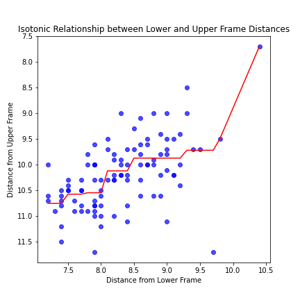

[](http://quantlet.de/)

## [](http://quantlet.de/) **PAV_Example_Eyeopen** [](http://quantlet.de/)

```yaml

Name of QuantLet : 'PAV_Example_Eyeopen'

Published in : 'PAV Courselet' 

Description : 'An eye-opening project for PAV with the dataset of bank notes.'

Keywords : 'PAV , Smooth'

Author : 'WK Haerdle Zuo Xiaorui'

Submitted : Sat, Nov 8 2023

```

