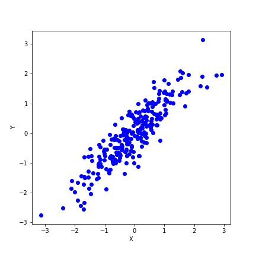
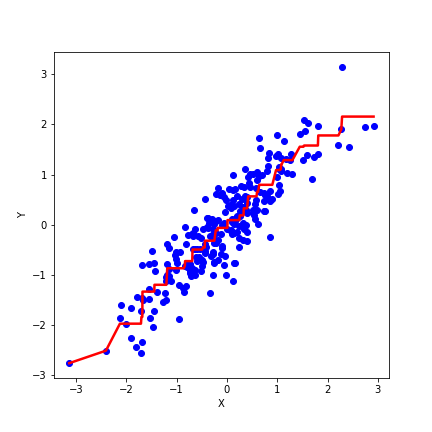

[](http://quantlet.de/)

## [](http://quantlet.de/) **PAV_Example_Logo** [](http://quantlet.de/)

```yaml

Name of QuantLet : 'PAV_Example_Logo'

Published in : 'PAV Courselet' 

Description : 'An example of calculationg PAV algorithm.'

Keywords : 'PAV , Smooth'

Author : 'WK Haerdle Zuo Xiaorui'

Submitted : Thu, Nov 9 2023

```





### [IPYNB Code: PAV_Example_Logo.ipynb](PAV_Example_Logo.ipynb)


automatically created on 2023-11-10