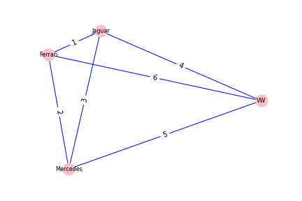

[](http://quantlet.de/)

## [](http://quantlet.de/) **PAV_Example_MDS** [](http://quantlet.de/)

```yaml

Name of QuantLet : 'PAV_Example_MDS'

Published in : 'PAV Courselet' 

Description : 'An MDS example for car brands.'

Keywords : 'PAV , Smooth'

Author : 'WK Haerdle Zuo Xiaorui'

Submitted : Sat, Nov 8 2023

```



### PYTHON Code
```python

import networkx as nx
import matplotlib.pyplot as plt
from sklearn.manifold import MDS

# Define the adjacency matrix, here we use a simple example
adjacency_matrix = [
    [0, 3, 2, 5],
    [3, 0, 1, 4],
    [2, 1, 0, 6],
    [5, 4, 6, 0]
]

# Create an undirected graph
G = nx.Graph()

# Add weighted edges to the graph
for i, row in enumerate(adjacency_matrix):
    for j, weight in enumerate(row):
        if i < j:  # Avoid adding duplicate edges
            G.add_edge(i, j, weight=weight)

# Use Multidimensional Scaling (MDS) to position nodes
mds = MDS(n_components=2, dissimilarity='precomputed', random_state=6)
pos = mds.fit_transform(adjacency_matrix)

# Convert the coordinates calculated by MDS into a pos dictionary in NetworkX format
pos_nx = {i: pos[i].tolist() for i in range(len(pos))}

# Draw the graph, with custom node names
node_labels = {3: 'VW', 2: 'Ferrari', 1: 'Jaguar', 0: "Mercedes"}
nx.draw(G, pos=pos_nx, labels=node_labels, edge_color='blue', with_labels=True, node_color='pink', font_size=8)

# Edge weight labels
edge_labels = nx.get_edge_attributes(G, 'weight')
nx.draw_networkx_edge_labels(G, pos=pos_nx, edge_labels=edge_labels, font_size=10)

# Save the figure to a file
plt.savefig("MDS.png", transparent=True)
# Display the figure
plt.show()

```

automatically created on 2023-11-09