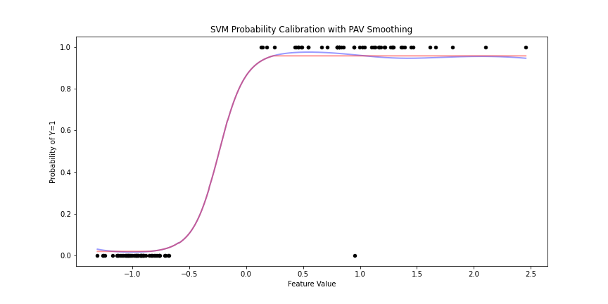

[](http://quantlet.de/)

## [](http://quantlet.de/) **PAV_Example_SVM** [](http://quantlet.de/)

```yaml

Name of QuantLet : 'PAV_Example_SVM'

Published in : 'PAV Courselet' 

Description : 'SVM example of isotonising SVM Classification results'

Keywords : 'PAV , Smooth, SVM'

Author : 'WK Haerdle Zuo Xiaorui'

Submitted : Sat, Nov 8 2023

```



### [IPYNB Code: PAV_example_SVM.ipynb](PAV_example_SVM.ipynb)


automatically created on 2023-11-09